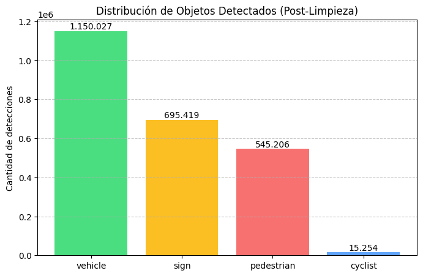
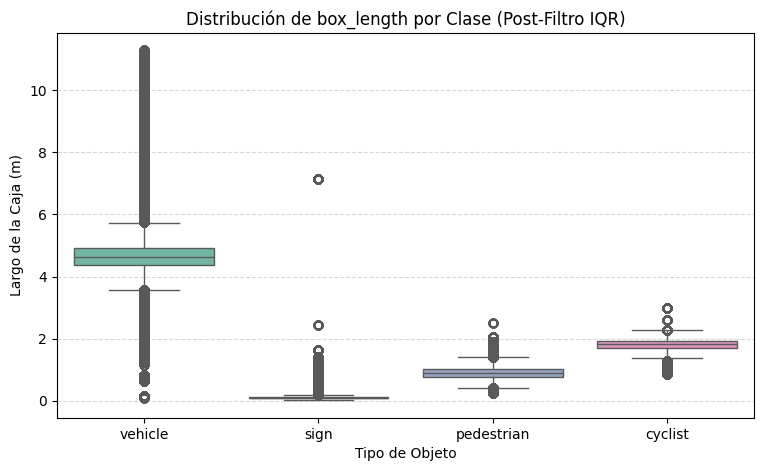
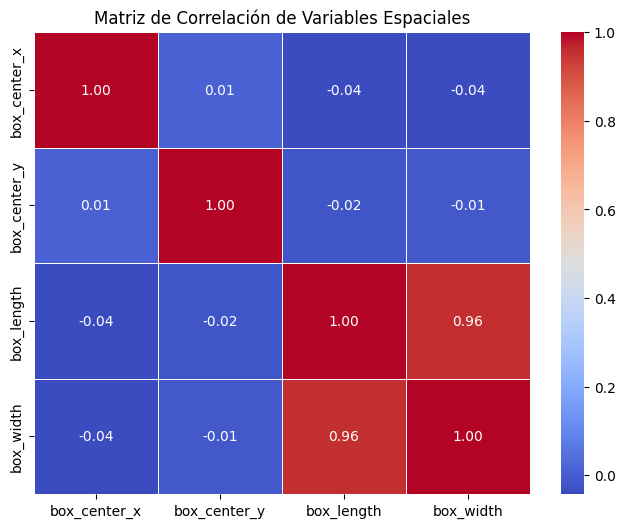

# Informe Técnico · Análisis Exploratorio y Preparación de Datos
## Waymo Open Dataset · Percepción LiDAR

**Asignatura:** MLY1101 Machine Learning · Evaluación Parcial N°1
**Equipo:** Martín Papic · Matías Retamal
**Metodología:** CRISP-DM
**Repositorio:** https://github.com/MartinPapic/waymo_motion

---

## 1. Descripción del problema de negocio

Un vehículo autónomo toma decisiones de frenado, aceleración y esquive a partir de lo que sus
sensores detectan a su alrededor. Cada una de esas decisiones se apoya en un modelo de Machine
Learning que fue entrenado con datos de conducción previos. Si esos datos están sucios o sesgados,
el error no se paga con una métrica baja: se paga con un atropello.

El problema de negocio que aborda este proyecto es anterior al modelo:

> **¿Podemos confiar en los datos crudos de los sensores LiDAR para entrenar un sistema de
> percepción, o requieren un proceso de validación previo que hoy no existe?**

Responder esto importa por tres razones concretas:

1. **Costo de reentrenamiento.** Detectar que los datos estaban sesgados después de entrenar un
   modelo obliga a repetir todo el ciclo. Auditar antes es órdenes de magnitud más barato.
2. **Riesgo de seguridad.** Una clase subrepresentada en los datos se traduce en falsos negativos
   sobre esa clase en producción. Si la clase subrepresentada son los peatones, el riesgo es vital.
3. **Escalabilidad del proceso.** El dataset completo de Waymo supera el terabyte. Cualquier
   validación manual es inviable: el proceso debe ser automatizado y reproducible.

### Alcance

Este proyecto **no entrena un modelo predictivo**. Su alcance es la construcción del pipeline de
datos y la auditoría de calidad y sesgo que debe preceder a cualquier entrenamiento, que es
exactamente la etapa donde se originan la mayoría de las fallas de un sistema de ML en producción.

---

## 2. Objetivos del proyecto

### Objetivo general

Diseñar e implementar una arquitectura de datos reproducible que transforme detecciones crudas de
sensores LiDAR en un dataset validado y auditado, apto para entrenar modelos de percepción.

### Objetivos específicos

| # | Objetivo | Evidencia verificable |
|---|----------|----------------------|
| 1 | Implementar un pipeline automatizado y reproducible de ingesta y limpieza | `kedro run` ejecuta el proceso completo sin intervención manual |
| 2 | Cuantificar la calidad de los datos crudos: duplicados, nulos y anomalías | Sección 5 de este informe, con cifras medidas |
| 3 | Caracterizar la distribución de las variables y detectar patrones aprovechables | Análisis exploratorio, Sección 5.3 |
| 4 | Auditar el sesgo de representación y proponer una mitigación demostrada | Sección 7, con SMOTE ejecutado sobre los datos reales |
| 5 | Entregar los resultados en un formato consumible por un usuario no técnico | Dashboard interactivo en React |

---

## 3. Definición de KPIs

Los indicadores se definieron de modo que cada uno sea **medible automáticamente por el pipeline**,
sin inspección manual, y se recalculan en cada ejecución.

| KPI | Definición operacional | Meta | Resultado obtenido |
|-----|------------------------|------|--------------------|
| **KPI 1 · Tasa de completitud post-limpieza** | Porcentaje de registros que sobreviven al pipeline respecto del crudo | ≥ 95% | **99,66%** |
| **KPI 2 · Tasa de anomalías detectadas** | Porcentaje de registros descartados por el filtro IQR | Entre 0,1% y 5% | **0,34%** |
| **KPI 3 · Razón de desbalance de clases** | Cociente entre la clase mayoritaria y la minoritaria | Reportado como indicador de riesgo ético | **75,4 : 1** |
| **KPI 4 · Reproducibilidad** | El pipeline completo corre end-to-end con un solo comando | Sí / No | **Sí** (`kedro run`) |
| **KPI 5 · Cobertura de pruebas del nodo de limpieza** | Tests unitarios que validan las reglas de negocio | ≥ 5 casos | **6 tests, todos en verde** |

### Interpretación de las metas

La meta del KPI 2 tiene un piso y un techo, y eso es deliberado. Un filtro que **no descarta nada**
indica que la regla no está funcionando, que fue justamente el defecto corregido durante el
desarrollo. Un filtro que descarta **demasiado** está mutilando datos válidos. El 0,34% obtenido
indica un sensor confiable y una regla que sí opera.

El KPI 3 no tiene meta numérica porque no es un objetivo a optimizar sino un **indicador de riesgo**:
mientras más alto, mayor la prioridad de aplicar técnicas de rebalanceo antes de entrenar.

---

## 4. Descripción de las fuentes de datos

### 4.1 Fuente primaria

| Atributo | Detalle |
|----------|---------|
| **Dataset** | Waymo Open Dataset v2.0.1, split de entrenamiento |
| **Origen** | Google Cloud Storage · `gs://waymo_open_dataset_v_2_0_1/training` |
| **Componentes usados** | `lidar_box` (cajas delimitadoras 3D) y `stats` (contexto del segmento) |
| **Acceso** | Requiere cuenta de Google que haya aceptado la licencia en waymo.com/open |
| **Licencia** | Uso no comercial para investigación; prohíbe la redistribución |
| **Volumen procesado** | 199 segmentos de conducción · **2.414.127 detecciones** · 16 variables |

Se descargaron **solo los componentes tabulares livianos** (~1 MB por segmento), descartando
imágenes y nubes de puntos completas, que superan 1 GB por segmento. Este patrón de *ingesta
efímera* permite trabajar con datos reales de escala industrial sin infraestructura especializada.

### 4.2 Diccionario de variables

| Variable | Tipo | Descripción |
|----------|------|-------------|
| `segment_id` | texto | Identificador del segmento de conducción (~20 s de manejo) |
| `timestamp_micros` | entero | Marca temporal del frame en microsegundos |
| `id_interno` | texto | Identificador del objeto, estable a lo largo del segmento |
| `object_type` | categórica | `vehicle`, `pedestrian`, `sign`, `cyclist` |
| `box_center_x/y/z` | decimal | Posición del objeto en metros, relativa al vehículo |
| `box_length/width/height` | decimal | Dimensiones físicas de la caja detectada, en metros |
| `num_lidar_points` | entero | Puntos láser que impactaron el objeto: proxy de confianza |
| `detection_difficulty` | categórica | Nivel de dificultad asignado por Waymo |
| `time_of_day`, `weather`, `location` | categóricas | Condiciones de captura del segmento |
| `speed_mps` | decimal | Magnitud de la velocidad del objeto, en metros por segundo |

### 4.3 Herramientas colaborativas

| Herramienta | Uso en el proyecto | Justificación |
|-------------|--------------------|---------------|
| **GitHub** | Control de versiones, ramas por tarea y Pull Requests | Permite trabajo paralelo sin pisarse, deja trazabilidad de quién hizo cada cambio y por qué, y hace revisable el trabajo del compañero antes de integrarlo |
| **Kedro** | Orquestación del pipeline y catálogo de datos | Separa la configuración del código, de modo que cambiar una ruta o un entorno no obliga a tocar la lógica |
| **Trello** | Seguimiento de tareas por etapa de CRISP-DM | Hace visible el avance y evita la duplicación de esfuerzo entre integrantes |
| **Google Cloud Storage** | Repositorio de origen de los datos | Es la fuente oficial del dataset |

---

## 5. Preparación y análisis exploratorio de los datos

### 5.1 Arquitectura del flujo

Se implementó una **arquitectura de medallón**, donde cada capa tiene una responsabilidad única y
los datos nunca se sobrescriben:

```
Google Cloud Storage
        │  scripts/descargar_waymo.py
        ▼
  data/01_raw/           BRONZE · 2.414.127 detecciones tal como llegan del sensor
        │  kedro run  →  clean_and_process_data()
        ▼
  data/02_intermediate/  SILVER · 2.405.906 registros validados, listos para ML
        │
        ▼
  data/03_primary/       GOLD · 1.000 filas para consumo del dashboard
        │
        ▼
  Dashboard React + Plotly
```

### 5.2 Auditoría de calidad de los datos crudos

| Chequeo | Resultado | Acción tomada |
|---------|-----------|---------------|
| Registros duplicados | **0** | Se aplica `drop_duplicates()` de todos modos, como salvaguarda del proceso |
| Valores nulos | **0 en las 16 variables** | La imputación por mediana queda implementada pero no se activa |
| Anomalías dimensionales | **8.221 (0,34%)** | Descartadas mediante regla IQR sobre `box_length` |
| Registros finales | **2.405.906** | Capa Silver |

**Por qué la mediana y no el cero.** El pipeline imputa nulos con la mediana de la variable, no con
cero. Rellenar con cero desplaza la distribución hacia abajo y deforma los cuartiles, lo que a su
vez corrompe el filtro de anomalías que depende de esos cuartiles. La mediana preserva la tendencia
central y es robusta ante valores extremos. En este dataset no hubo nulos, pero la regla queda
implementada para datasets de otros segmentos.

**Por qué el rango intercuartílico.** La regla IQR define como anómalo todo valor fuera del
intervalo `[Q1 − 1,5·IQR, Q3 + 1,5·IQR]`. A diferencia de un umbral fijo, se adapta a la
distribución real de los datos y no requiere conocer de antemano las dimensiones de un camión.

**Sobre qué variable se aplica el filtro.** El filtro opera sobre `box_length`, la dimensión física
de la caja detectada. El pipeline también aplica la regla sobre la velocidad absoluta cuando el
dataset incluye las componentes `speed_x`/`speed_y`; esta tabla de percepción no las trae, por lo
que ese camino no se activa. Las 8.221 detecciones descartadas corresponden a cajas cuyo largo es
físicamente imposible para el objeto declarado, es decir, errores de medición del sensor.

### 5.3 Análisis exploratorio

#### Distribución de clases



| Clase | Detecciones | Participación |
|-------|-------------|---------------|
| `vehicle` | 1.150.027 | 47,8% |
| `sign` | 695.419 | 28,9% |
| `pedestrian` | 545.206 | 22,7% |
| `cyclist` | 15.254 | **0,6%** |

**Hallazgo 1.** La distribución está severamente desbalanceada: por cada ciclista detectado hay
**75,4 vehículos**. Este es el hallazgo que sostiene toda la auditoría ética de la Sección 7.

#### Dimensiones por clase y justificación del filtro



**Hallazgo 2.** Cada clase tiene una firma dimensional propia y estable, lo que legitima filtrar por
tamaño. Una precisión metodológica relevante: el filtro del pipeline se aplica sobre la
**distribución global** de `box_length`, mientras que este gráfico separa **por clase**. Por eso
siguen apareciendo puntos fuera de los bigotes: son atípicos respecto de su propia clase, pero
plausibles dentro del conjunto. No son errores que hayan escapado al filtro.

#### Correlación entre variables



**Hallazgo 3.** Las variables dimensionales (`box_length`, `box_width`, `box_height`) correlacionan
fuertemente entre sí: son tres formas de medir el mismo concepto subyacente, el tamaño del objeto.
Esto constituye **multicolinealidad** y anticipa que una reducción de dimensionalidad como PCA sería
pertinente antes de modelar. Las coordenadas espaciales, en cambio, son prácticamente independientes
entre sí y aportan información no redundante.

#### Separabilidad de las clases

En el gráfico de dispersión largo contra ancho (visible en el dashboard interactivo), las clases
forman clústers visiblemente distintos. **Esto es una buena noticia para el modelamiento futuro:**
las clases son separables con dos variables simples, lo que sugiere que un clasificador básico
alcanzaría buen desempeño y confirma que las dimensiones físicas son las variables con mayor poder
predictivo del dataset.

### 5.4 Preparación para el modelamiento

| # | Transformación | Implementación | Justificación |
|---|----------------|----------------|---------------|
| 1 | Codificación de categóricas | *One-hot encoding* sobre `object_type` | Los algoritmos requieren entradas numéricas, y una codificación ordinal introduciría un orden inexistente entre las clases. No aprende nada de la distribución, por lo que puede aplicarse antes de particionar |
| 2 | Partición train/test | 80/20 **estratificada** por `object_type` | Sin estratificar, con 0,6% de ciclistas el conjunto de prueba podría quedar sin representación de la clase minoritaria |
| 3 | Escalado de numéricas | `StandardScaler` ajustado **solo con el conjunto de entrenamiento** | Las variables tienen escalas dispares; los modelos basados en distancia (KNN, SVM, redes neuronales) quedarían dominados por las de mayor magnitud |

Resultado: **1.924.724 registros de entrenamiento** y **481.182 de prueba**, con la proporción de
clases preservada en ambos conjuntos.

**El orden de estos pasos no es arbitrario.** El `StandardScaler` calcula una media y una desviación
estándar a partir de los datos. Si se ajustara sobre el dataset completo, esos parámetros
incorporarían información del conjunto de prueba y la evaluación quedaría contaminada: se estaría
midiendo el desempeño sobre datos que ya influyeron en el preprocesamiento. Es una forma sutil de
**fuga de datos**. La regla general —*toda transformación que aprenda de los datos se ajusta solo con
el entrenamiento*— se aplica aquí y también explica por qué SMOTE opera después de la partición
(Sección 7.1).

La evidencia queda visible en la salida del notebook: tras el escalado, la media del conjunto de
entrenamiento es prácticamente cero (−9,92·10⁻¹⁸), mientras que la del conjunto de prueba es
+0,0005. Esa diferencia es exactamente lo que se espera cuando el test se transforma con parámetros
que no fueron calculados sobre él.

---

## 6. Metodología CRISP-DM

| Fase | Aplicación en este proyecto | Evidencia |
|------|----------------------------|-----------|
| **1. Comprensión del negocio** | Se define el problema como una pregunta de confiabilidad de datos previa al modelo, con KPIs medibles | Secciones 1 a 3 |
| **2. Comprensión de los datos** | Ingesta desde GCS, diccionario de variables, auditoría de volumen, tipos y calidad | Sección 4 y notebook §2 |
| **3. Preparación de los datos** | Pipeline Kedro: deduplicación, imputación robusta, filtro IQR, codificación, escalado y partición | Sección 5 y notebook §3 y §5 |
| **4. Modelamiento** | **Fuera del alcance de esta entrega.** Los datos quedan preparados y particionados para la etapa siguiente | Sección 5.4 |
| **5. Evaluación** | Se evalúa la calidad del dataset resultante mediante los KPIs definidos, no el desempeño de un modelo | Sección 3 |
| **6. Despliegue** | Capa de consumo en JSON y dashboard interactivo para usuarios no técnicos | `frontend/` |

Una decisión metodológica relevante: **el notebook importa la misma función que ejecuta el
pipeline** (`clean_and_process_data`), en lugar de reimplementar la limpieza. Esto elimina el riesgo
de que la memoria documente un proceso distinto del que realmente corre en producción, que es una
fuente habitual de inconsistencias entre documentación y código.

---

## 7. Evaluación de sesgos, ética y privacidad

### 7.1 Sesgo de representación

El dataset presenta un desbalance severo, ya cuantificado: **75,4 vehículos por cada ciclista**.

**Impacto concreto.** Un clasificador entrenado con esta distribución puede alcanzar un 99% de
exactitud global ignorando por completo a los ciclistas, porque son el 0,6% de la muestra. La
métrica se vería excelente mientras el sistema es ciego ante la clase más vulnerable de la vía. Esto
no es una hipótesis: es la consecuencia matemática directa de optimizar exactitud sobre datos
desbalanceados.

**Mitigación demostrada.** El notebook ejecuta SMOTE sobre el conjunto de entrenamiento preparado.
La técnica genera ejemplos sintéticos de las clases minoritarias interpolando entre vecinos
cercanos, y deja las cuatro clases equilibradas:

| Clase | Antes de SMOTE | Después de SMOTE |
|-------|----------------|------------------|
| `vehicle` | 47.429 | 47.429 |
| `sign` | 29.090 | 47.429 |
| `pedestrian` | 22.781 | 47.429 |
| `cyclist` | **700** | **47.429** |

*La demostración se ejecuta sobre una submuestra de 100.000 filas por costo computacional; el
resultado es equivalente al aplicarla sobre el total.*

**Alternativas evaluadas.** El *undersampling* descarta datos válidos de la clase mayoritaria y se
desestimó por eso. La ponderación de clases en la función de pérdida es una opción válida, pero
depende del algoritmo que se elija en la etapa de modelamiento y por lo tanto excede este alcance.

### 7.2 Otros sesgos identificados

| Sesgo | Descripción | Mitigación propuesta |
|-------|-------------|----------------------|
| **De muestreo** | Los 199 segmentos procesados son un subconjunto de los 798 disponibles, y podrían no representar toda la diversidad de condiciones | Las variables `weather`, `time_of_day` y `location` permiten verificar la cobertura y, de ser necesario, muestrear de forma estratificada por condición |
| **Geográfico** | El dataset proviene de ciudades de Estados Unidos, con infraestructura vial, señalética y comportamiento peatonal propios | Un modelo entrenado con estos datos no es directamente trasladable a otro país sin validación local |
| **De condiciones de captura** | Predominan condiciones despejadas y diurnas, donde el LiDAR rinde mejor | Ponderar o ampliar la recolección en lluvia y de noche, que es cuando el sistema más se necesita |

### 7.3 Privacidad

El Waymo Open Dataset se distribuye **anonimizado en origen**: Waymo aplica difuminado a rostros y
patentes antes de la publicación, y los componentes utilizados en este proyecto (`lidar_box` y
`stats`) son **puramente geométricos**. No contienen imágenes, identificadores personales ni
información que permita reconocer a una persona.

Medidas adoptadas por el equipo:

- **No redistribución.** La licencia prohíbe redistribuir los datos. Por eso el dataset completo
  está excluido del control de versiones mediante `.gitignore`, y el repositorio solo incluye una
  muestra reducida para fines de reproducibilidad académica.
- **No cruce de fuentes.** Las coordenadas son relativas al vehículo, no geográficas absolutas. El
  proyecto no las cruza con ninguna otra fuente que pudiera permitir reidentificación.
- **Trazabilidad del origen.** El script de descarga documenta exactamente qué se obtuvo y desde
  dónde, de modo que cualquier revisor puede auditar la procedencia.

---

## 8. Reproducción de los resultados

### 8.1 Ejecución rápida, sin credenciales

El repositorio incluye una muestra de **12 segmentos y 103.430 detecciones (4,3 MB)** que permite
ejecutar el pipeline completo inmediatamente después de clonar:

```bash
cd backend
pip install -r requirements.txt
kedro run --env muestra
```

### 8.2 Ejecución con el dataset completo

Requiere una cuenta de Google que haya aceptado la licencia en https://waymo.com/open/download/:

```bash
gcloud auth application-default login
cd backend
python scripts/descargar_waymo.py --lote 200
# el script deja el parquet en backend/datos/waymo_real/; se copia a data/01_raw/
kedro run
```

### 8.3 Memoria, pruebas y dashboard

```bash
jupyter notebook backend/notebooks/EP1_Memoria_Waymo_Motion.ipynb   # memoria CRISP-DM
cd backend && pytest tests/                                          # 6 tests unitarios
cd frontend && npm install && npm run dev                            # dashboard interactivo
```

### 8.4 Estructura del proyecto

```
waymo_motion/
├── INFORME_TECNICO.md          Este documento
├── README.md                   Guía de instalación y ejecución
├── images/                     Gráficos del análisis exploratorio
├── backend/
│   ├── conf/base/              Catálogo de datos y parámetros de Kedro
│   ├── conf/muestra/           Entorno que usa la muestra versionada
│   ├── data/01_raw/            Capa Bronze (solo la muestra se versiona)
│   ├── data/02_intermediate/   Capa Silver
│   ├── data/03_primary/        Capa Gold
│   ├── models/                 Reservada para la etapa de modelamiento
│   ├── notebooks/              Memoria CRISP-DM ejecutable
│   ├── scripts/                Descarga desde Google Cloud Storage
│   ├── src/waymo_backend/      Código del pipeline
│   └── tests/                  Pruebas unitarias del nodo de limpieza
└── frontend/                   Dashboard React + Plotly
```

---

## 9. Limitaciones y trabajo futuro

1. **Velocidad no incorporada al pipeline.** El dataset incluye `speed_mps`, pero el pipeline solo
   busca las componentes `speed_x`/`speed_y`, ausentes en esta tabla. Incorporarla requiere cuidado:
   su distribución está muy sesgada hacia cero (mediana 0,013 m/s, porque la mayoría de los objetos
   detectados están detenidos), de modo que **aplicarle la regla IQR global descartaría como
   anómalo todo objeto que circule sobre 7 km/h**. La vía correcta es usarla como variable
   predictiva y aplicar umbrales de plausibilidad física por clase.

2. **Trayectorias sin explotar.** Las variables `id_interno` y `timestamp_micros` permiten seguir un
   mismo objeto a lo largo del segmento y reconstruir su trayectoria. Es la extensión natural del
   proyecto y habilitaría análisis de movimiento, no solo de detecciones estáticas.

3. **Muestra parcial.** Se procesaron 199 de los 798 segmentos del split de entrenamiento. Ampliar
   la cobertura reduciría el sesgo de muestreo descrito en la Sección 7.2.

4. **Sin etapa de modelamiento.** Por definición del alcance. Los datos quedan codificados,
   escalados y particionados, listos para entrenar.
